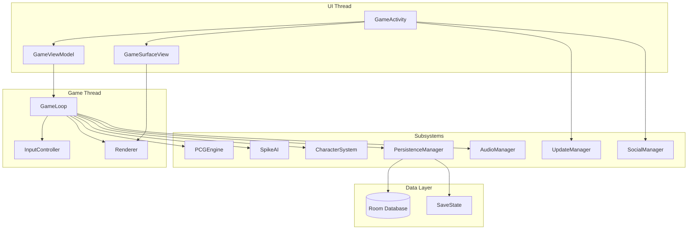
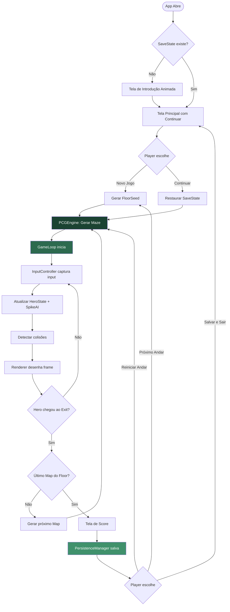
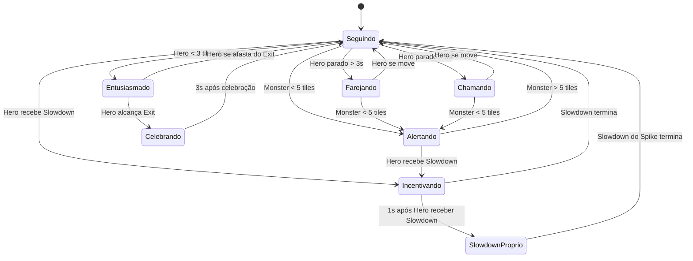

# Design Técnico — Spike na Caverna

## Visão Geral

"Spike na Caverna" é um jogo Android em Kotlin puro, sem engine externa, com visão isométrica em modo landscape. O jogador controla um herói e seu cachorro Spike explorando uma caverna de até 120 andares gerados proceduralmente.

Este documento descreve as decisões de arquitetura, os subsistemas principais e as propriedades de correção que guiam o desenvolvimento. Ele foi escrito para ser acessível a desenvolvedores juniores — cada decisão técnica importante vem acompanhada do "porquê".

---

## Arquitetura Geral

### Padrão MVC Adaptado para Game Loop

O jogo usa uma variação do padrão MVC (Model-View-Controller) adaptada para o contexto de game loop:

- **Model** — Estado do jogo: `GameState`, `MazeData`, `HeroState`, `SpikeState`, `SaveState`
- **View** — Renderização: `GameSurfaceView`, `Renderer`, subsistemas de HUD
- **Controller** — Lógica: `GameLoop` (thread dedicada), `InputController`, subsistemas de negócio

> **Por que MVC e não MVVM puro?** MVVM com LiveData/StateFlow é ótimo para UIs reativas, mas o game loop precisa de controle preciso sobre quando o estado é lido e escrito a cada frame. O MVC adaptado mantém o GameLoop como orquestrador central sem a latência de observers assíncronos durante o ciclo de renderização.

### Injeção de Dependência Manual

Sem Dagger/Hilt. Os subsistemas são instanciados e conectados manualmente em `GameActivity` e `GameViewModel`.

> **Por que sem Dagger/Hilt?** Para manter o código acessível a desenvolvedores juniores. Dagger/Hilt adiciona complexidade de anotações e geração de código que obscurece o fluxo de dependências. Com DI manual, cada dependência é explícita e rastreável.

### WeakReference para Contextos de Longa Vida

Componentes que sobrevivem ao ciclo de vida da Activity (GameLoop, AudioManager, PersistenceManager) referenciam `Context` e `Activity` via `WeakReference<T>`.

> **Por que WeakReference?** Se um componente em background mantiver uma referência forte à Activity, o garbage collector não consegue liberar a Activity destruída, causando vazamento de memória. WeakReference permite que o GC colete a Activity normalmente; o componente verifica se a referência ainda é válida antes de usá-la.


---

## Diagrama de Arquitetura



---

## Diagrama de Fluxo Principal do Jogo




---

## Estrutura de Pacotes do Projeto Android

```
com.ericleber.joguinho/
├── core/
│   ├── GameLoop.kt              # Thread dedicada, fixed timestep
│   ├── GameState.kt             # Estado global do jogo (Model)
│   └── GameActivity.kt          # Entry point Android
│
├── renderer/
│   ├── GameSurfaceView.kt       # SurfaceView principal
│   ├── Renderer.kt              # Orquestrador de renderização isométrica
│   ├── IsometricProjection.kt   # Conversão coordenadas mundo → tela
│   ├── SpriteCache.kt           # Cache de Bitmaps pré-renderizados
│   ├── TileRenderer.kt          # Renderização de tiles por Biome
│   ├── CharacterRenderer.kt     # Renderização de Hero, Spike, Monsters
│   ├── ParticleSystem.kt        # Partículas via Canvas
│   └── HudRenderer.kt           # HUD: score, slowdown, combo
│
├── pcg/
│   ├── PCGEngine.kt             # Orquestrador de geração procedural
│   ├── BSPMazeGenerator.kt      # Algoritmo BSP para labirintos
│   ├── MazeValidator.kt         # Validação BFS de caminho válido
│   ├── EntityPlacer.kt          # Posicionamento de Monsters e Traps
│   └── BiomeParameters.kt       # Parâmetros de geração por Biome
│
├── input/
│   ├── InputController.kt       # Captura e processa touch events
│   ├── FloatingJoystick.kt      # Joystick virtual flutuante
│   └── DPadController.kt        # Controle alternativo D-pad
│
├── character/
│   ├── PlayableCharacter.kt     # Abstração de personagem controlável
│   ├── CompanionCharacter.kt    # Abstração de companheiro
│   ├── Hero.kt                  # Implementação concreta do Hero
│   ├── Spike.kt                 # Implementação concreta do Spike
│   ├── SpikeAI.kt               # Máquina de estados do Spike
│   ├── SkinSystem.kt            # Resolução de skins em tempo de render
│   └── CharacterRegistry.kt     # Registro central de personagens
│
├── persistence/
│   ├── PersistenceManager.kt    # Orquestrador de persistência
│   ├── SaveState.kt             # Data class do estado completo
│   ├── AppDatabase.kt           # Room Database
│   ├── SaveStateDao.kt          # DAO para operações de SaveState
│   └── SaveStateEntity.kt       # Entidade Room
│
├── audio/
│   └── AudioManager.kt          # SoundPool + MediaPlayer, fade entre Biomes
│
├── social/
│   └── SocialManager.kt         # Geração de imagem + Intent de compartilhamento
│
├── update/
│   └── UpdateManager.kt         # In-App Updates API (Google Play)
│
├── biome/
│   ├── Biome.kt                 # Enum/sealed class dos 6 Biomes
│   └── BiomePalette.kt          # Paletas de cores por Biome
│
└── ui/
    ├── GameViewModel.kt         # ViewModel: ponte UI ↔ GameLoop
    ├── MainMenuActivity.kt      # Tela principal
    └── ScoreActivity.kt         # Tela de Score
```


---

## Subsistema 1: GameLoop

### Responsabilidade

Orquestrar o ciclo de atualização do jogo em uma thread dedicada, separada da UI thread do Android.

> **Por que thread separada?** O Android tem um limite rígido: operações na UI thread que demoram mais de 16ms causam "jank" (travamento visível). O GameLoop precisa processar física, IA e renderização a cada frame. Rodando em thread própria, o jogo não bloqueia a UI thread e o Android pode gerenciar os dois independentemente.

### Fixed Timestep com Delta Time

```kotlin
// GameLoop.kt — conceito de fixed timestep
class GameLoop(private val surfaceHolder: SurfaceHolder) : Thread() {
    private val targetFps = 60
    private val targetFrameTime = 1_000_000_000L / targetFps // nanosegundos
    private var running = false

    override fun run() {
        var lastTime = System.nanoTime()
        var accumulator = 0L

        while (running) {
            val now = System.nanoTime()
            val elapsed = now - lastTime
            lastTime = now
            accumulator += elapsed

            // Processa atualizações em passos fixos de 16.6ms
            while (accumulator >= targetFrameTime) {
                update(targetFrameTime / 1_000_000_000f) // deltaTime em segundos
                accumulator -= targetFrameTime
            }

            // Renderiza com interpolação
            val alpha = accumulator.toFloat() / targetFrameTime
            render(alpha)

            // Dorme o tempo restante para não queimar CPU
            val sleepTime = targetFrameTime - (System.nanoTime() - now)
            if (sleepTime > 0) sleep(sleepTime / 1_000_000)
        }
    }
}
```

> **Por que fixed timestep?** Com delta time variável, a física e o movimento ficam inconsistentes entre dispositivos lentos e rápidos. O fixed timestep garante que a simulação seja determinística — o mesmo input sempre produz o mesmo resultado, independente do hardware.

### Redução de FPS em Pausa e Temperatura Crítica

- Em pausa: reduz para 5fps (apenas animação mínima da tela de pausa)
- Em temperatura crítica (`ThermalStatusCallback`): reduz para 30fps e exibe ícone de temperatura na HUD

---

## Subsistema 2: Renderer

### Projeção Isométrica

A visão isométrica converte coordenadas de mundo (grid 2D) para coordenadas de tela usando a projeção:

```kotlin
// IsometricProjection.kt
object IsometricProjection {
    // Tile base: 32x32px lógicos, escalados por densidade
    fun worldToScreen(worldX: Int, worldY: Int, tileW: Float, tileH: Float): PointF {
        val screenX = (worldX - worldY) * (tileW / 2f)
        val screenY = (worldX + worldY) * (tileH / 2f)
        return PointF(screenX, screenY)
    }
}
```

> **Por que Canvas e não OpenGL ES?** Canvas é suficiente para pixel art 2D isométrica a 60fps em dispositivos modernos. OpenGL ES exigiria shaders, buffers de vértices e gerenciamento de contexto GL — complexidade desnecessária que tornaria o código inacessível para desenvolvedores juniores. Canvas com `Paint.filterBitmap = false` preserva a estética pixel art sem interpolação bilinear.

### Culling de Tiles

Apenas tiles dentro da viewport são desenhados. O culling calcula quais células do grid isométrico intersectam o retângulo da tela:

```kotlin
// Renderer.kt — culling simplificado
fun getVisibleTiles(camera: RectF, tileW: Float, tileH: Float): List<TileCoord> {
    // Converte bounds da câmera de volta para coordenadas de mundo
    // e retorna apenas as células visíveis
    // Limita a no máximo 200 draw calls por frame (Requisito 8.3)
}
```

> **Por que culling?** Um mapa de 50x50 tiles tem 2500 células. Desenhar todas a cada frame desperdiça CPU/GPU. Com culling, apenas ~100-200 tiles visíveis são desenhados, mantendo o jogo fluido mesmo em mapas grandes.

### Cache de Bitmaps (SpriteCache)

Sprites gerados proceduralmente são pré-renderizados uma vez na inicialização e armazenados como `Bitmap` em memória. A regeneração ocorre apenas quando `onTrimMemory` sinaliza memória baixa.

```kotlin
// SpriteCache.kt
class SpriteCache {
    private val cache = HashMap<String, Bitmap>()

    fun getOrCreate(key: String, generator: () -> Bitmap): Bitmap {
        return cache.getOrPut(key) { generator() }
    }

    fun evictNonEssential() {
        // Remove sprites de Biomes não ativos; regenera sob demanda
        cache.entries.removeIf { it.key.startsWith("biome_") && !it.key.contains(currentBiome) }
    }
}
```

### Paint.filterBitmap = false

```kotlin
val pixelArtPaint = Paint().apply {
    isFilterBitmap = false  // Desativa interpolação bilinear
    isAntiAlias = false     // Mantém bordas nítidas do pixel art
}
```


---

## Subsistema 3: PCG (Procedural Content Generation)

### Algoritmo BSP para Labirintos

O algoritmo BSP (Binary Space Partitioning) divide recursivamente o espaço do mapa em regiões menores, criando salas e corredores:

```
1. Começa com o retângulo completo do mapa
2. Divide em dois sub-retângulos (horizontal ou vertical, aleatório)
3. Repete recursivamente até atingir tamanho mínimo de sala
4. Conecta salas adjacentes com corredores
5. Resultado: labirinto com garantia estrutural de conectividade
```

> **Por que BSP?** BSP garante que todas as salas sejam conectadas por construção — a conectividade é uma propriedade emergente do algoritmo, não algo que precisa ser verificado depois. Outros algoritmos como Cellular Automata geram mapas mais orgânicos mas sem garantia de conectividade, exigindo pós-processamento.

### FloorSeed Determinístico

```kotlin
// PCGEngine.kt
fun generateMaze(floorNumber: Int, mapIndex: Int, playerSeed: Long): MazeData {
    // Combina FloorSeed do player com índice do mapa para unicidade
    val seed = playerSeed xor (floorNumber.toLong() shl 32) xor mapIndex.toLong()
    val random = Random(seed)
    return BSPMazeGenerator(random).generate(getDimensions(floorNumber))
}
```

> **Por que FloorSeed determinístico?** Permite que o jogador reinicie um andar e encontre exatamente o mesmo labirinto (Requisito 2.7). Também facilita debugging — um bug em um mapa específico pode ser reproduzido com o mesmo seed.

### Validação BFS

Após a geração, o `MazeValidator` executa BFS da posição inicial até o Exit para confirmar que existe caminho válido:

```kotlin
// MazeValidator.kt
fun hasValidPath(maze: MazeData): Boolean {
    val visited = BooleanArray(maze.width * maze.height)
    val queue: Queue<Int> = LinkedList()
    queue.add(maze.startIndex)
    while (queue.isNotEmpty()) {
        val current = queue.poll()
        if (current == maze.exitIndex) return true
        // Adiciona vizinhos transitáveis não visitados
        getNeighbors(current, maze).forEach { neighbor ->
            if (!visited[neighbor]) {
                visited[neighbor] = true
                queue.add(neighbor)
            }
        }
    }
    return false
}
```

### Escalonamento de Dificuldade por Faixa de Floor

| Faixa de Floor | Densidade de Paredes | Monsters por Map | Traps por Map |
|---|---|---|---|
| 1–20 | 40%–55% | `min(2 + floor(n/10), 12)` | `min(1 + floor(n/15), 8)` |
| 21–60 | 55%–70% | idem | idem |
| 61–120 | 70%–85% | idem | idem |

### Fallback de Maze

Se a geração falhar 3 vezes consecutivas (ex: BSP produz mapa sem caminho válido por bug), o PCGEngine usa um `FallbackMaze` pré-definido por faixa de Floor, garantindo que o jogo nunca trave na geração.

---

## Subsistema 4: InputController

### Floating Joystick

O joystick virtual é reposicionado para onde o jogador toca na metade esquerda da tela:

```kotlin
// FloatingJoystick.kt
class FloatingJoystick {
    var centerX = 0f
    var centerY = 0f
    val radius = 80.dp  // Mínimo 80dp (Requisito 4.1)

    fun onTouchDown(x: Float, y: Float) {
        // Reposiciona o centro do joystick para o ponto de toque
        centerX = x
        centerY = y
    }

    fun getDirection(): Vector2 {
        // Retorna vetor normalizado da direção
        // Mapeia para 8 direções cardinais/diagonais
    }
}
```

### Escala por Densidade de Tela

```kotlin
// InputController.kt
val Float.dp: Float get() = this * Resources.getSystem().displayMetrics.density
```

Todas as áreas de toque são definidas em `dp` e convertidas para pixels em tempo de execução, garantindo tamanho físico consistente em qualquer dispositivo.

### D-pad Alternativo

Implementado como `DPadController`, ativável nas configurações. Exibe 4 botões direcionais fixos como alternativa ao joystick flutuante (Requisito 12.3).

---

## Subsistema 5: PersistenceManager

### Room Database

```kotlin
// SaveStateEntity.kt
@Entity(tableName = "save_states")
data class SaveStateEntity(
    @PrimaryKey(autoGenerate = true) val id: Int = 0,
    val timestamp: Long,
    val snapshotIndex: Int,  // 0, 1 ou 2 (3 snapshots de segurança)
    val saveStateJson: String  // SaveState serializado como JSON
)
```

> **Por que Room Database?** Room é a solução oficial do Android para persistência estruturada. Oferece type-safety via DAOs, suporte a coroutines, e integra com Android Auto Backup automaticamente. SharedPreferences seria insuficiente para o volume de dados do SaveState.

### 3 Snapshots de Segurança

O PersistenceManager mantém um buffer circular de 3 snapshots. A cada save, o snapshot mais antigo é substituído:

```kotlin
// PersistenceManager.kt
suspend fun save(state: SaveState) {
    val snapshotIndex = (getLatestSnapshotIndex() + 1) % 3
    val entity = SaveStateEntity(
        timestamp = System.currentTimeMillis(),
        snapshotIndex = snapshotIndex,
        saveStateJson = Json.encodeToString(state)
    )
    dao.insertOrReplace(entity)
}
```

### Serialização com kotlinx.serialization

```kotlin
@Serializable
data class SaveState(
    val version: Int = 1,
    val floorNumber: Int,
    val mapIndex: Int,
    val floorSeed: Long,
    val heroPosition: Position,
    val heroState: HeroState,
    val spikeState: SpikeState,
    val monsters: List<MonsterState>,
    val traps: List<TrapState>,
    val floorTimerMs: Long,
    val accumulatedScore: Float,
    val comboStreak: Int,
    val statistics: PlayerStatistics,
    val achievements: Set<String>,
    // Campos opcionais para extensibilidade futura (Requisito 24.6)
    val activeCharacterId: String = "hero",
    val activeSkinId: String = "default"
)
```

### Android Auto Backup

Configurado em `backup_rules.xml` para incluir o banco Room e excluir logs internos.


---

## Subsistema 6: AudioManager

### SoundPool + MediaPlayer

- **SoundPool**: efeitos sonoros curtos (passos, ativação de trap, contato com monster, conclusão de map). Carregados em memória para reprodução de baixa latência.
- **MediaPlayer**: trilha sonora ambiente por Biome, com loop contínuo.

### Fade entre Biomes

```kotlin
// AudioManager.kt
fun transitionToBiome(newBiome: Biome) {
    // Fade out da trilha atual em 1 segundo
    // Fade in da nova trilha
    // Usa coroutine para não bloquear a UI thread
    scope.launch {
        fadeOut(currentPlayer, durationMs = 1000)
        currentPlayer = MediaPlayer.create(contextRef.get() ?: return@launch, newBiome.musicResId)
        fadeIn(currentPlayer, durationMs = 1000)
    }
}
```

### Pausa em onPause

```kotlin
override fun onPause() {
    super.onPause()
    audioManager.pauseAll()  // Máximo 100ms (Requisito 9.4)
    gameLoop.pause()
    persistenceManager.saveAsync()
}
```

---

## Subsistema 7: SocialManager

### Geração de Imagem via Canvas

```kotlin
// SocialManager.kt
fun generateShareImage(floorNumber: Int, totalTimeMs: Long, totalMaps: Int): Bitmap {
    val bitmap = Bitmap.createBitmap(1080, 1080, Bitmap.Config.ARGB_8888)
    val canvas = Canvas(bitmap)
    // Desenha fundo com paleta do Biome atual
    // Desenha logo "Spike na Caverna"
    // Desenha estatísticas com fonte pixel art
    // Desenha sprite do Spike em pose de celebração
    return bitmap
}

fun share(bitmap: Bitmap) {
    val uri = saveBitmapToCache(bitmap)
    val intent = Intent(Intent.ACTION_SEND).apply {
        type = "image/png"
        putExtra(Intent.EXTRA_STREAM, uri)
        addFlags(Intent.FLAG_GRANT_READ_URI_PERMISSION)
    }
    context.startActivity(Intent.createChooser(intent, "Compartilhar"))
}
```

---

## Subsistema 8: UpdateManager

### In-App Updates API

```kotlin
// UpdateManager.kt
class UpdateManager(private val activity: GameActivity) {
    private val appUpdateManager = AppUpdateManagerFactory.create(activity)

    fun checkForUpdates() {
        appUpdateManager.appUpdateInfo.addOnSuccessListener { info ->
            when {
                info.updateAvailability() == UpdateAvailability.UPDATE_AVAILABLE
                    && info.isUpdateTypeAllowed(AppUpdateType.FLEXIBLE) -> {
                    // Atualização opcional: diálogo não bloqueante
                    startFlexibleUpdate(info)
                }
                info.updateAvailability() == UpdateAvailability.UPDATE_AVAILABLE
                    && info.isUpdateTypeAllowed(AppUpdateType.IMMEDIATE) -> {
                    // Atualização obrigatória: diálogo bloqueante
                    startImmediateUpdate(info)
                }
            }
        }
    }
}
```

---

## Subsistema 9: CharacterSystem

### Hierarquia de Abstrações

```kotlin
// PlayableCharacter.kt
abstract class PlayableCharacter {
    abstract val id: String
    abstract val baseSpeed: Float
    abstract val skinId: String
    var currentState: CharacterState = CharacterState.IDLE
    var isSlowedDown: Boolean = false
    val effectiveSpeed: Float get() = if (isSlowedDown) baseSpeed * 0.4f else baseSpeed

    abstract fun getAnimationFrames(state: CharacterState): List<Bitmap>
    abstract fun onSlowdown(durationMs: Long)
}

// CompanionCharacter.kt
abstract class CompanionCharacter {
    abstract val id: String
    abstract val skinId: String
    abstract fun updateAI(heroPosition: Position, mazeData: MazeData, gameEvents: List<GameEvent>)
    abstract fun getAnimationFrames(state: CompanionState): List<Bitmap>
}

// CharacterRegistry.kt
object CharacterRegistry {
    private val characters = mutableMapOf<String, PlayableCharacter>()
    fun register(character: PlayableCharacter) { characters[character.id] = character }
    fun get(id: String): PlayableCharacter = characters[id] ?: characters["hero"]!!
}
```

### SkinSystem

```kotlin
// SkinSystem.kt
data class SkinDefinition(
    val id: String,
    val primaryColor: Int,
    val secondaryColor: Int,
    val accentColor: Int,
    val shapeVariant: Int = 0,
    val decorativeDetails: List<DecorativeDetail> = emptyList()
)

object SkinSystem {
    private val skins = mutableMapOf<String, SkinDefinition>()

    fun resolveSkin(skinId: String): SkinDefinition =
        skins[skinId] ?: skins["default"]!!
}
```


---

## Subsistema 10: SpikeAI — Máquina de Estados

### Diagrama de Estados do Spike



### Implementação da Máquina de Estados

```kotlin
// SpikeAI.kt
class SpikeAI(private val spike: Spike) {

    enum class SpikeState {
        SEGUINDO, FAREJANDO, ALERTANDO, INCENTIVANDO,
        SLOWDOWN_PROPRIO, ENTUSIASMADO, CHAMANDO, CELEBRANDO
    }

    private var currentState = SpikeState.SEGUINDO
    private var stateTimer = 0f

    fun update(deltaTime: Float, context: SpikeAIContext) {
        stateTimer += deltaTime
        currentState = when (currentState) {
            SpikeState.SEGUINDO -> evaluateTransitions(context)
            SpikeState.FAREJANDO -> if (context.heroMoved) SpikeState.SEGUINDO else SpikeState.FAREJANDO
            SpikeState.ALERTANDO -> if (context.nearestMonsterDistance > 5f) SpikeState.SEGUINDO else SpikeState.ALERTANDO
            SpikeState.INCENTIVANDO -> if (stateTimer > 1f) SpikeState.SLOWDOWN_PROPRIO else SpikeState.INCENTIVANDO
            SpikeState.SLOWDOWN_PROPRIO -> if (!context.spikeIsSlowed) SpikeState.SEGUINDO else SpikeState.SLOWDOWN_PROPRIO
            SpikeState.ENTUSIASMADO -> if (context.heroDistanceToExit > 3f) SpikeState.SEGUINDO else SpikeState.ENTUSIASMADO
            SpikeState.CHAMANDO -> if (context.heroMoved) SpikeState.SEGUINDO else SpikeState.CHAMANDO
            SpikeState.CELEBRANDO -> if (stateTimer > 3f) SpikeState.SEGUINDO else SpikeState.CELEBRANDO
        }
        spike.currentState = currentState.toCompanionState()
    }

    private fun evaluateTransitions(ctx: SpikeAIContext): SpikeState = when {
        ctx.heroReceivedSlowdown -> { stateTimer = 0f; SpikeState.INCENTIVANDO }
        ctx.heroDistanceToExit < 3f -> SpikeState.ENTUSIASMADO
        ctx.nearestMonsterDistance < 5f -> SpikeState.ALERTANDO
        ctx.heroStoppedDuration > 5f -> SpikeState.CHAMANDO
        ctx.heroStoppedDuration > 3f -> SpikeState.FAREJANDO
        else -> SpikeState.SEGUINDO
    }
}
```

---

## Modelos de Dados

### SaveState — Esquema Completo

| Campo | Tipo | Descrição |
|---|---|---|
| `version` | `Int` | Versão do schema para migrações futuras |
| `floorNumber` | `Int` | Andar atual (1–120) |
| `mapIndex` | `Int` | Índice do Map dentro do Floor |
| `floorSeed` | `Long` | Seed determinístico do Floor |
| `heroPosition` | `Position` | Coordenadas (x, y) do Hero no grid |
| `heroState` | `HeroState` | Estado atual do Hero (velocidade, slowdown) |
| `spikePosition` | `Position` | Coordenadas do Spike |
| `spikeState` | `SpikeState` | Estado atual do Spike |
| `monsters` | `List<MonsterState>` | Estado de cada Monster (posição, padrão de movimento) |
| `traps` | `List<TrapState>` | Estado de cada Trap (posição, ativada/inativa) |
| `floorTimerMs` | `Long` | Tempo acumulado no Floor atual em ms |
| `accumulatedScore` | `Float` | Score acumulado com bônus de combo |
| `comboStreak` | `Int` | ComboStreak atual |
| `comboBonus` | `Float` | Bônus acumulado de ComboStreak |
| `statistics` | `PlayerStatistics` | Estatísticas cumulativas do jogador |
| `achievements` | `Set<String>` | IDs das conquistas desbloqueadas |
| `personalBests` | `Map<Int, Long>` | Melhor tempo por Floor (floorNumber → ms) |
| `activeCharacterId` | `String` | ID do personagem ativo (padrão: "hero") |
| `activeSkinId` | `String` | ID da skin ativa (padrão: "default") |

### Position

```kotlin
@Serializable
data class Position(val x: Int, val y: Int)
```

### MazeData

```kotlin
data class MazeData(
    val width: Int,
    val height: Int,
    val tiles: IntArray,       // 0 = caminho, 1 = parede
    val startIndex: Int,
    val exitIndex: Int,
    val floorNumber: Int,
    val seed: Long
)
```


---

## Biomas e Paletas de Cores

### Os 6 Biomas

```kotlin
// Biome.kt
enum class Biome(
    val floorRange: IntRange,
    val displayName: String
) {
    MINA_ABANDONADA(1..20, "Mina Abandonada"),
    RIACHOS_SUBTERRANEOS(21..40, "Riachos Subterrâneos"),
    PLANTACOES_ABRIGOS(41..60, "Plantações e Abrigos"),
    CONSTRUCOES_ROCHOSAS(61..80, "Construções Rochosas"),
    POMARES_ABERTURAS(81..100, "Pomares e Aberturas"),
    ERA_DINOSSAUROS(101..120, "Era dos Dinossauros")
}
```

### Paletas de Cores por Bioma

```kotlin
// BiomePalette.kt
data class BiomePalette(
    val wallColor: Int,
    val floorColor: Int,
    val accentColor: Int,
    val ambientLight: Int,
    val particleColor: Int,
    val backgroundColor: Int
)

val BIOME_PALETTES = mapOf(
    Biome.MINA_ABANDONADA to BiomePalette(
        wallColor    = 0xFF4A3728.toInt(),  // Marrom escuro (rocha)
        floorColor   = 0xFF2C1F14.toInt(),  // Marrom muito escuro
        accentColor  = 0xFFD4A017.toInt(),  // Dourado (veios de ouro)
        ambientLight = 0xFFFF8C00.toInt(),  // Laranja (tocha)
        particleColor= 0xFF8B6914.toInt(),  // Poeira dourada
        backgroundColor = 0xFF1A1008.toInt()
    ),
    Biome.RIACHOS_SUBTERRANEOS to BiomePalette(
        wallColor    = 0xFF2E4A3E.toInt(),  // Verde musgo escuro
        floorColor   = 0xFF1A3028.toInt(),  // Verde muito escuro
        accentColor  = 0xFF4FC3F7.toInt(),  // Azul água
        ambientLight = 0xFF00BCD4.toInt(),  // Ciano (reflexo da água)
        particleColor= 0xFF81D4FA.toInt(),  // Gotículas de água
        backgroundColor = 0xFF0D1F1A.toInt()
    ),
    Biome.PLANTACOES_ABRIGOS to BiomePalette(
        wallColor    = 0xFF3D5A2A.toInt(),  // Verde folha escuro
        floorColor   = 0xFF2A3D1A.toInt(),  // Terra escura
        accentColor  = 0xFF8BC34A.toInt(),  // Verde claro (plantas)
        ambientLight = 0xFFAED581.toInt(),  // Verde suave (bioluminescência)
        particleColor= 0xFF558B2F.toInt(),  // Esporos verdes
        backgroundColor = 0xFF1A2810.toInt()
    ),
    Biome.CONSTRUCOES_ROCHOSAS to BiomePalette(
        wallColor    = 0xFF5D4E37.toInt(),  // Pedra arenosa
        floorColor   = 0xFF3D3020.toInt(),  // Pedra escura
        accentColor  = 0xFFBDBDBD.toInt(),  // Cinza pedra
        ambientLight = 0xFF9E9E9E.toInt(),  // Luz fria (pedra)
        particleColor= 0xFFD7CCC8.toInt(),  // Poeira de pedra
        backgroundColor = 0xFF1C1510.toInt()
    ),
    Biome.POMARES_ABERTURAS to BiomePalette(
        wallColor    = 0xFF4A6741.toInt(),  // Verde floresta
        floorColor   = 0xFF2D4A28.toInt(),  // Grama escura
        accentColor  = 0xFFFF8F00.toInt(),  // Laranja (frutas)
        ambientLight = 0xFFFFF176.toInt(),  // Amarelo (luz solar filtrada)
        particleColor= 0xFFFFCC02.toInt(),  // Pólen dourado
        backgroundColor = 0xFF1A2E15.toInt()
    ),
    Biome.ERA_DINOSSAUROS to BiomePalette(
        wallColor    = 0xFF6D4C41.toInt(),  // Marrom avermelhado (lama pré-histórica)
        floorColor   = 0xFF4E342E.toInt(),  // Marrom escuro
        accentColor  = 0xFFE53935.toInt(),  // Vermelho (lava distante)
        ambientLight = 0xFFFF7043.toInt(),  // Laranja vulcânico
        particleColor= 0xFFFF5722.toInt(),  // Faíscas de lava
        backgroundColor = 0xFF1A0A00.toInt()
    )
)
```

---

## Assets Visuais Programáticos

### Hero — Pixel Art Isométrica

- 8 direções de movimento (N, NE, E, SE, S, SW, W, NW)
- 8+ frames por ciclo de caminhada
- 4 frames para idle
- Gerado via Canvas com formas geométricas: corpo (retângulo arredondado), cabeça (círculo), mochila (retângulo), lanterna (círculo com gradiente radial)
- Escala base: 32x48px lógicos

### Spike — Pixel Art Isométrica

- Viralata branco com manchas pretas no dorso e patas
- 12+ frames por estado comportamental
- Estados: seguindo, farejando, alertando, incentivando, celebrando, chamando, entusiasmado
- Gerado via Canvas: corpo (elipse), cabeça (círculo), orelhas (triângulos), rabo (curva bezier), manchas (elipses pretas)

### Tiles — 32x32px Base

Cada tile é gerado como `Bitmap` 32x32 com variações por Bioma:
- **Parede**: forma 3D isométrica com face superior, face lateral esquerda e face lateral direita
- **Chão**: textura procedural com variações de cor dentro da paleta do Bioma
- **Decorativo**: elementos específicos por Bioma (cristais, cogumelos, pedras, raízes)

### Monstros — Geração Procedural de Aparência

```kotlin
data class MonsterAppearance(
    val bodyColor: Int,
    val eyeColor: Int,
    val bodyShape: MonsterBodyShape,  // ROUND, SPIKY, FLAT, TALL
    val size: Float,                  // 0.5f a 1.5f (relativo ao tile)
    val hasHorns: Boolean,
    val hasWings: Boolean,
    val animationSpeed: Float
)
```


---

## Propriedades de Correção

*Uma propriedade é uma característica ou comportamento que deve ser verdadeiro em todas as execuções válidas de um sistema — essencialmente, uma afirmação formal sobre o que o sistema deve fazer. Propriedades servem como ponte entre especificações legíveis por humanos e garantias de correção verificáveis por máquina.*

### Propriedade 1: Todo Maze gerado tem caminho válido

*Para qualquer* FloorSeed, número de Floor e índice de Map, o Maze gerado pelo PCGEngine deve conter exatamente um caminho transitável da posição inicial do Hero até o Exit, verificável por BFS. Esta propriedade deve se manter mesmo após o posicionamento de Monsters e Traps pelo EntityPlacer.

**Valida: Requisitos 2.2, 2.6**

### Propriedade 2: Geração de Maze é determinística

*Para qualquer* FloorSeed, número de Floor e índice de Map, chamar `PCGEngine.generateMaze()` duas vezes com os mesmos parâmetros deve produzir estruturas de Maze idênticas (mesmas paredes, mesma posição inicial, mesmo Exit, mesmas posições de Monsters e Traps).

**Valida: Requisito 2.7**

### Propriedade 3: Densidade de paredes respeita a faixa do Floor

*Para qualquer* Maze gerado com `floorNumber` em qualquer faixa válida (1–120), a proporção de tiles de parede em relação à área total do Map deve estar dentro do intervalo correspondente à faixa: [40%–55%] para floors 1–20, [55%–70%] para floors 21–60, e [70%–85%] para floors 61–120.

**Valida: Requisitos 2.3, 2.4, 2.5**

### Propriedade 4: Round-trip de SaveState

*Para qualquer* `SaveState` válido, serializar com `Json.encodeToString()` e depois deserializar com `Json.decodeFromString()` deve produzir um objeto estruturalmente equivalente ao original, com todos os campos preservados com os mesmos valores.

**Valida: Requisito 7.1, 22.2**

### Propriedade 5: Score é monotonicamente decrescente com o tempo

*Para quaisquer* dois tempos `t1 < t2` (em segundos, ambos positivos) e o mesmo `comboBonus`, o `baseScore` calculado para `t1` deve ser estritamente maior que o `baseScore` calculado para `t2`. Formalmente: `(10000 / t1) * (1 + bonus) > (10000 / t2) * (1 + bonus)` quando `t1 < t2`.

**Valida: Requisito 6.2**

### Propriedade 6: Fórmulas de escalonamento de entidades respeitam os limites

*Para qualquer* `floorNumber` entre 1 e 120, a quantidade de Monsters calculada por `min(2 + floor(floorNumber / 10), 12)` deve estar sempre no intervalo [2, 12], e a quantidade de Traps calculada por `min(1 + floor(floorNumber / 15), 8)` deve estar sempre no intervalo [1, 8].

**Valida: Requisitos 5.5, 5.6**

### Propriedade 7: Troca de personagem preserva progresso

*Para qualquer* `SaveState` com progresso registrado (floorNumber, floorSeed, accumulatedScore), alterar o campo `activeCharacterId` e recarregar o SaveState deve preservar todos os campos de progressão sem alteração.

**Valida: Requisito 24.8**

### Propriedade 8: Culling limita draw calls

*Para qualquer* posição de câmera e qualquer tamanho de Map, o número de tiles retornados por `Renderer.getVisibleTiles()` deve ser no máximo 200.

**Valida: Requisito 8.3**

---

## Tratamento de Erros

### Estratégia Geral

Todos os subsistemas críticos envolvem operações em blocos `try-catch`. Exceções são registradas em log interno (arquivo no armazenamento do dispositivo) sem expor detalhes ao jogador.

### Por Subsistema

| Subsistema | Erro | Comportamento |
|---|---|---|
| Renderer | Exceção durante frame | Pula o frame, continua no próximo |
| PersistenceManager | Falha ao salvar | 3 tentativas com 100ms de intervalo |
| PersistenceManager | SaveState corrompido | Restaura snapshot anterior, notifica jogador |
| PCGEngine | Maze inválido após 3 tentativas | Usa Maze de fallback pré-definido |
| AudioManager | Falha ao carregar áudio | Continua sem áudio, sem crash |
| UpdateManager | Falha de rede | Prossegue normalmente, sem mensagem de erro |

### Log Interno

```kotlin
// Logger.kt
object Logger {
    private val logFile = File(context.filesDir, "spike_caverna.log")

    fun error(tag: String, message: String, throwable: Throwable? = null) {
        val entry = "${System.currentTimeMillis()} [ERROR] $tag: $message\n${throwable?.stackTraceToString() ?: ""}"
        logFile.appendText(entry)
    }
}
```

---

## Estratégia de Testes

### Abordagem Dual: Testes Unitários + Testes Baseados em Propriedades

Os dois tipos de teste são complementares e ambos são necessários:
- **Testes unitários**: verificam exemplos específicos, casos de borda e condições de erro
- **Testes de propriedade**: verificam propriedades universais com centenas de inputs gerados aleatoriamente

> **Por que testes de propriedade?** Testes unitários verificam os casos que o desenvolvedor pensou em testar. Testes de propriedade encontram os casos que o desenvolvedor *não* pensou — inputs inesperados que violam invariantes do sistema.

### Biblioteca de Property-Based Testing

**[Kotest](https://kotest.io/)** com o módulo `kotest-property` para Kotlin/Android.

```kotlin
// Exemplo de teste de propriedade com Kotest
class PCGPropertyTest : StringSpec({
    "todo Maze gerado tem caminho válido" {
        // Feature: caverna-do-spike, Propriedade 1: Todo Maze gerado tem caminho válido
        checkAll(100, Arb.long(), Arb.int(1..120), Arb.int(0..4)) { seed, floor, mapIdx ->
            val maze = PCGEngine.generateMaze(floor, mapIdx, seed)
            MazeValidator.hasValidPath(maze) shouldBe true
        }
    }
})
```

Cada teste de propriedade deve rodar no mínimo **100 iterações** (configurado via `checkAll(100, ...)`).

### Testes Unitários — Foco

- Exemplos específicos de geração de Maze (floor 1, floor 60, floor 120)
- Casos de borda: FloorSeed = 0, FloorSeed = Long.MAX_VALUE
- Comportamento de fallback do PCGEngine após 3 falhas
- Comportamento do UpdateManager com "Lembrar depois"
- Comportamento do PersistenceManager com 3 tentativas de save

### Testes de Integração

- Ciclo de vida Android: `onPause` → save → `onResume` → restore
- Fluxo completo de persistência: save → reinício do processo → restore
- Integridade após múltiplos ciclos de save/restore

### Nomenclatura em Português

Todos os nomes de métodos de teste, comentários e descrições devem ser escritos em português do Brasil (Requisito 22.7):

```kotlin
@Test
fun `deve calcular score corretamente com combo bonus`() { ... }

@Test
fun `deve restaurar snapshot anterior quando SaveState esta corrompido`() { ... }
```

### Mapeamento Propriedade → Teste

| Propriedade | Teste de Propriedade | Tag |
|---|---|---|
| P1: Maze tem caminho válido | `PCGPropertyTest.todo Maze gerado tem caminho válido` | Feature: caverna-do-spike, Propriedade 1 |
| P2: Geração determinística | `PCGPropertyTest.mesmo seed gera mesmo Maze` | Feature: caverna-do-spike, Propriedade 2 |
| P3: Densidade de paredes | `PCGPropertyTest.densidade de paredes respeita faixa do Floor` | Feature: caverna-do-spike, Propriedade 3 |
| P4: Round-trip SaveState | `PersistencePropertyTest.serializar e deserializar SaveState preserva todos os campos` | Feature: caverna-do-spike, Propriedade 4 |
| P5: Score monotônico | `ScorePropertyTest.score e monotonicamente decrescente com o tempo` | Feature: caverna-do-spike, Propriedade 5 |
| P6: Fórmulas de escalonamento | `PCGPropertyTest.quantidade de entidades respeita limites por Floor` | Feature: caverna-do-spike, Propriedade 6 |
| P7: Troca de personagem preserva progresso | `CharacterPropertyTest.trocar personagem nao altera progresso` | Feature: caverna-do-spike, Propriedade 7 |
| P8: Culling limita draw calls | `RendererPropertyTest.culling nao excede 200 draw calls` | Feature: caverna-do-spike, Propriedade 8 |


---

## Decisões Técnicas — Resumo

| Decisão | Alternativa Considerada | Justificativa |
|---|---|---|
| Canvas para renderização | OpenGL ES | Suficiente para pixel art 2D; muito mais simples para devs juniores; `Paint.filterBitmap = false` preserva estética pixel art |
| BSP para PCG | Cellular Automata, Drunk Walk | BSP garante conectividade por construção; determinístico com seed; escalonamento de dificuldade via parâmetros de divisão |
| Room Database | SharedPreferences, SQLite direto | Type-safety via DAOs; suporte nativo a coroutines; integração com Auto Backup; migrações estruturadas |
| Thread dedicada para GameLoop | Coroutine no Main thread | Isolamento total da UI thread; controle preciso de timing; sem risco de ANR |
| DI manual | Dagger/Hilt | Acessibilidade para devs juniores; fluxo de dependências explícito e rastreável |
| WeakReference para Context | Referência forte | Previne vazamento de memória quando Activity é destruída |
| kotlinx.serialization | Gson, Moshi | Biblioteca oficial Kotlin; suporte a data classes com `@Serializable`; sem reflexão em runtime |
| Kotest para PBT | JUnit5 + QuickCheck | Suporte nativo a Kotlin; API fluente; integração com coroutines; módulo de property testing bem mantido |
| SoundPool para efeitos | ExoPlayer | Baixa latência para sons curtos; API simples; sem overhead de streaming |
| In-App Updates API | Verificação manual de versão | API oficial Google Play; suporte a atualizações flexíveis e imediatas; UX padronizada |

---

## Considerações de Performance

### Memória

- Limite de 150MB de RAM durante gameplay (Requisito 8.4)
- `SpriteCache.evictNonEssential()` chamado em `onTrimMemory(TRIM_MEMORY_RUNNING_LOW)`
- `Bitmap.recycle()` explícito ao encerrar cada Map
- Monitoramento via `Debug.getNativeHeapAllocatedSize()`

### CPU

- Fixed timestep evita processamento desnecessário em frames rápidos
- Culling reduz draw calls de ~2500 para ~200 por frame
- Geração procedural ocorre apenas uma vez por Map (não a cada frame)
- Operações de persistência em coroutines (não bloqueiam o GameLoop)

### Bateria

- GameLoop suspende completamente em `onPause` (máximo 100ms)
- Reduz para 5fps em pausa (apenas animação mínima)
- WorkManager para operações de background (respeita Doze Mode)
- WakeLock apenas durante persistência crítica, liberado imediatamente após

### Doze Mode

> **O que é Doze Mode?** Quando o dispositivo fica inativo por um tempo, o Android entra em Doze Mode e restringe operações de rede e CPU em background para economizar bateria. O jogo usa WorkManager para agendar operações não críticas (como sincronização de conquistas) nas "janelas de manutenção" que o Doze Mode abre periodicamente.

